# 3. CTRPFの開発環境を構築する

## 3.1. 前準備

### 3.1.1. Nanquitas's Playgroundに参加する

※必要なファイルをダウンロードするために、Discordサーバーの[Nanquitas's Playground](https://discord.gg/z4ZMh27)に参加してください。

1. ユーザー名を入力して**はい**をクリック。

    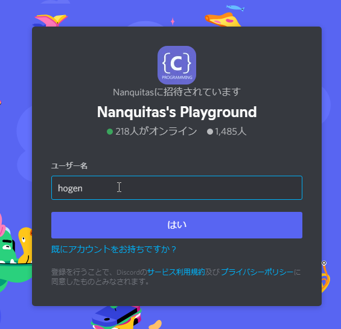

1. 私は人間ですにチェックを入れる。

1. なんとかして解く

    

1. 生年月日を入力して**完了**をクリック。

    

1. バツマークをクリック

    

    以上でサーバーに参加できました。

### 3.1.2. 7-zipのインストール

必要なファイルがtar.bz2という拡張子で配布されていて、デフォルトのままだと展開できないため、7-zipをインストールしてください。

1. [7-zip](https://sevenzip.osdn.jp/)にアクセス。

1. 一番上の**ダウンロード**をクリックし、開く。

    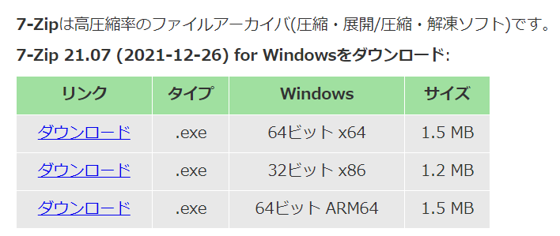

1. **Install**をクリック。

    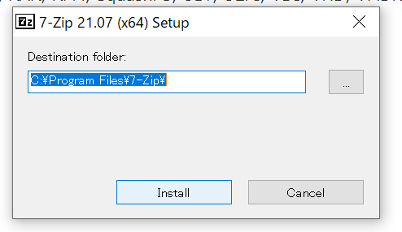

1. **Close**をクリック。

    

    以上で7-zipのインストールが完了しました。

### 3.1.3. エクスプローラーの設定

1. エクスプローラーを開く。

1. 表示タブをクリック。

    

1. 以下の設定にする。

- 項目チェックボックスにチェックを入れない
- ファイル名拡張子にチェックを入れる
- 隠しファイルにチェックを入れる

    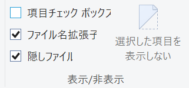

    以上でエクスプローラーの設定が完了しました。

## 3.2. devkitProのインストール

1. Microsoft Edgeをダブルクリック。

    

1. **devkitpro**と検索。

    

1. **Releases・devkitPro/installer・GitHub**をクリック。

    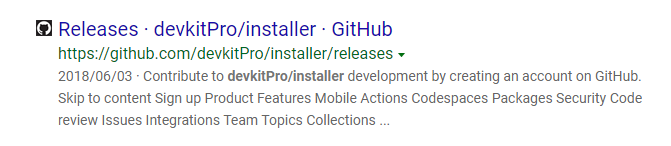

1. **devkitProUpdater-3.0.3.exe**をクリックし、ダウンロード。

   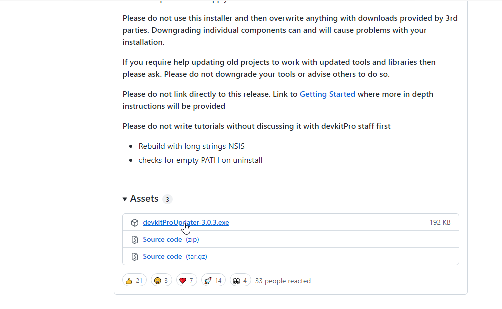

1. ダウンロードが完了したら開く。

    

1. **Next**をクリック。

    

1. **Next**をクリック。

    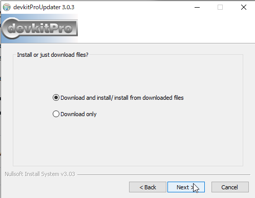

1. **Next**をクリック。

    

1. **Next**をクリック。

    

1. **Next**をクリック。

    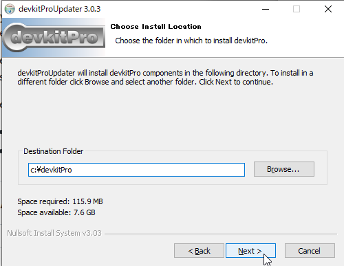

1. **Install**をクリック。

    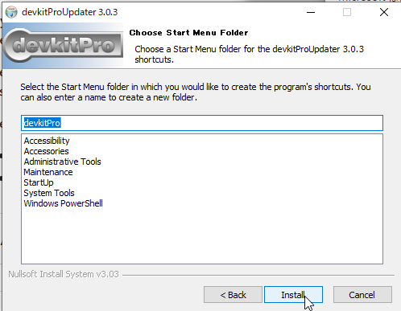

1. **Next**をクリック。

    

1. **Finish**をクリック。

    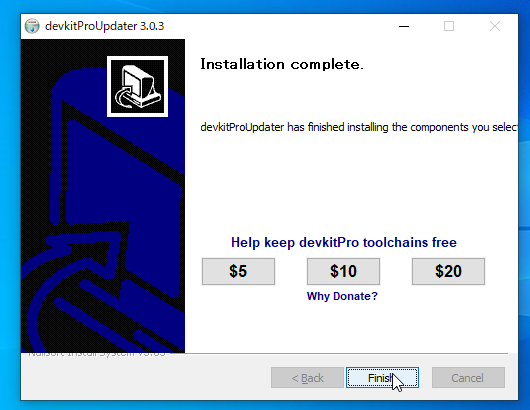

    以上でdevkitProのインストールが完了しました。

## 3.3. libctrpf-0.7.2のインストール

1. **info_releases**チャンネルをクリック。

    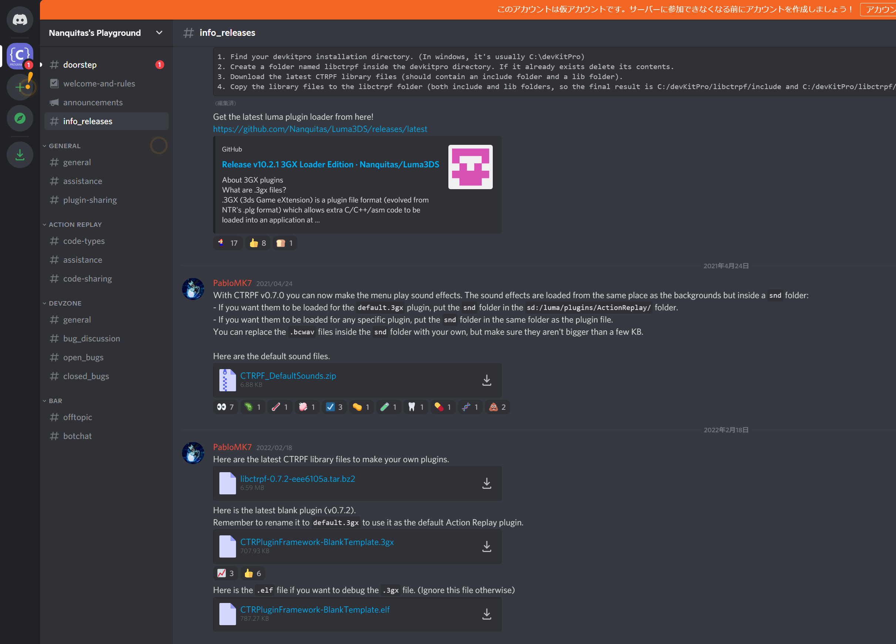

1. **libctrpf-0.7.2.eee6105a.tar.bz2**をクリックし、ダウンロード。

    

1. ++win+e++キーを同時押しし、エクスプローラーを開く。

1. **ダウンロード**をクリック。

    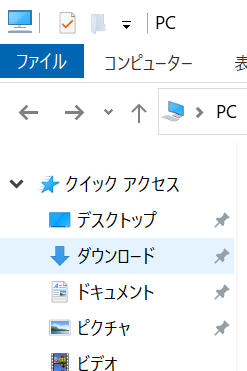

1. **libctrpf-0.7.2.eee6105a.tar.bz2を右クリックし、7-zip→展開…をクリック。

1. **OK**をクリック。

    

1. **libctrpf-0.7.2.eee6105a.tar**をダブルクリック。

    

1. **libctrpf-0.7.2.eee6105a.tar**を右クリックし、7-zip→展開…をクリック。

1. **OK**をクリック。

    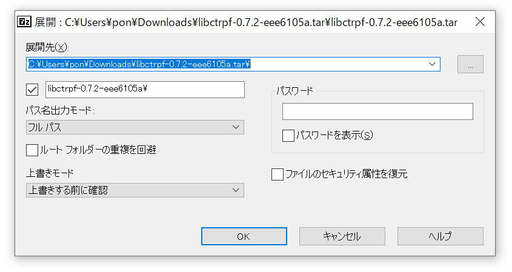

1. **libctrpf-0.7.2.eee6105a**をダブルクリック。

    

1. 2つのフォルダーを選択して、++ctrl+c++キーでコピー。

    

1. 左の欄の**PC**をクリック。

    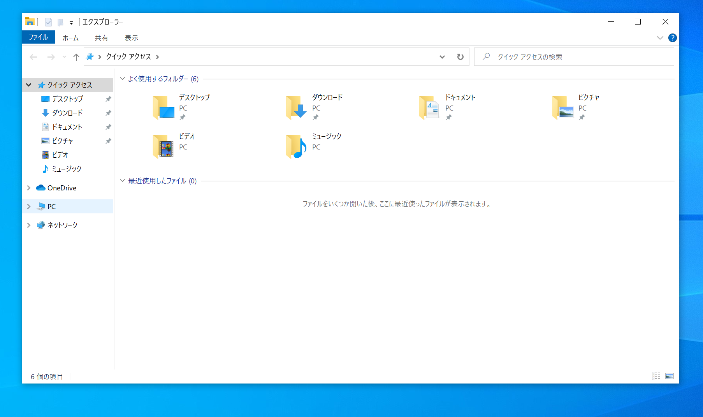

1. ローカルディスクをダブルクリック。

    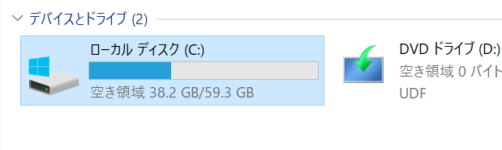

1. devkitProをダブルクリック。

    

1. ++ctrl+shift+n++キーで新規フォルダーを作成。名前は**libctrpf**にする。

    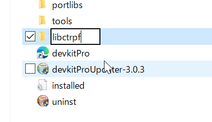

1. libctrpfをダブルクリック。

    

1. ++ctrl+v++キーで貼り付ける。

    

    以上でlibctrpfのインストールが完了しました。

## 3.4. 3gxtool.exeのインストール

1. 3gxtool.exeをクリックし、ダウンロード。

    

1. 3gxtool.exeを選択し、++ctrl+c++でコピー。

    

1. PC→ローカルディスク→devkitPro→tools→binをダブルクリック。

    

1. ++ctrl+v++で貼り付ける。

    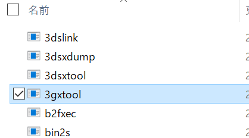

    以上で3gxtool.exeのインストールが完了しました。

## 3.5. CTRPFソースのダウンロード

1. **CTRPluginFramework-BlankTemplate**をクリック。

    

1. 緑色のCodeをクリック、Download ZIPをクリックし、ダウンロード。

    

1. ダウンロードフォルダーを開いて、**CTRPluginFramework-BlankTemplate-master.zip**を右クリックし、7-zip→展開…で展開をする。

1. **CTRPluginFramework-BlankTemplate-master**の中にもう1つ同名のフォルダーがあるので、それをコピーする。

    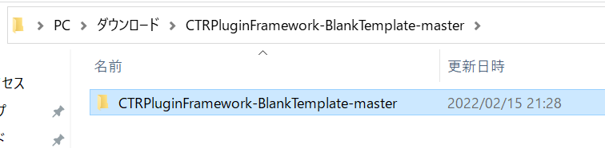

1. PC→ローカルディスク→ユーザー→ユーザー名→を開き、Programという名前でフォルダーを作る。

    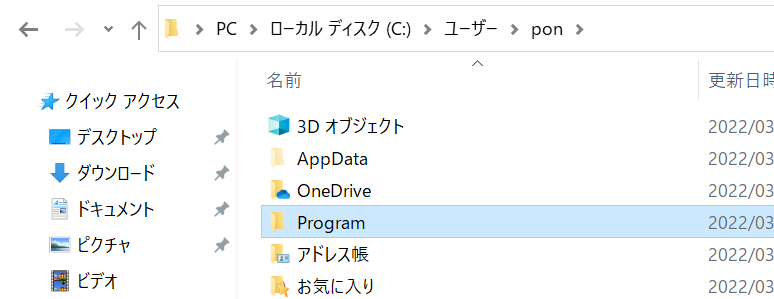

1. Programの中にCTRPFという名前でフォルダーを作る。

    

1. CTRPFの中に**CTRPluginFramework-BlankTemplate-master**をコピーする。

    

    以上でCTRPFのソースのダウンロードが完了しました。
