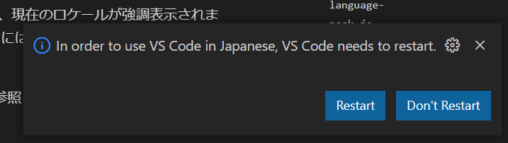
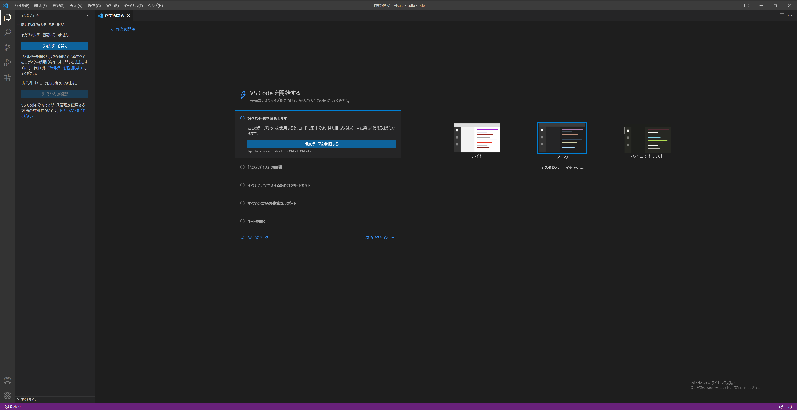

# 4. Visual Studio Codeの環境を構築する

- 無料
- そもそも高機能（とくに統合ターミナルとコードフォーマットが便利）
- さらに拡張機能による拡張性が極めて高い
- ユーザー数が多いことから、エラーが発生したときになんとか解決することが多い。

以上の点からここではVisual Studio Codeをインストールします。

## 4.1. Visual Studio Codeのインストール

1. [Visual Studio Code](https://code.visualstudio.com/download) にアクセスする。

1. **Windows**をクリックし、ダウンロードして開く。

    

1. **同意する**をクリックし、**次へ**をクリック。

    

1. **次へ**をクリック。

    

1. **次へ**をクリック。

    

1. すべてチェックを入れ、**次へ**をクリック。

    

1. **インストール**をクリック。

    

1. **完了**をクリック。

    

    以上でVisual Studio Codeのインストールが完了しました。

## 4.2. Visual Studio Codeの日本語化

1. **Extensions**をクリック。

    このメニューで拡張機能のインストールを行うことができます。

    

1. **japanese**と検索、**Japanese Language Pack for VS Code**を選択し、**Install**をクリック。

    

1. 左下の通知の**Restart**をクリックして、VS Codeを再起動。

    

    以上でVS Codeの日本語化が完了しました。

    

## 4.3. C++開発の環境を構築する

デフォルトのままだとコードの色付け位しかされないため、拡張機能を追加します。

主に追加される機能は以下の通りです。

- 関数名や変数名の自動補完
- コードフォーマット
- 強化されたコードの色付け
- クイック情報
- 定義に移動

1. **Extensions**をクリックし、c++と検索し、**C/C++ Extension Pack**をインストール。

    

    このように表示されたら導入が完了しています。

    

## 4.4. Git関連の拡張機能をインストール

VS CodeにGit関連のプラグインをインストールすると、ほとんどのことはVS Code内で完結できます。

### 4.4.1. Git Graph

リポジトリのグラフをわかりやすくする。

1. **git graph**と検索し、インストール。

    

### 4.4.2. GitLens

ソースコードの行に誰がいつコードを変更したのかを表示する。

1. **gitlens**と検索し、インストール。

    
